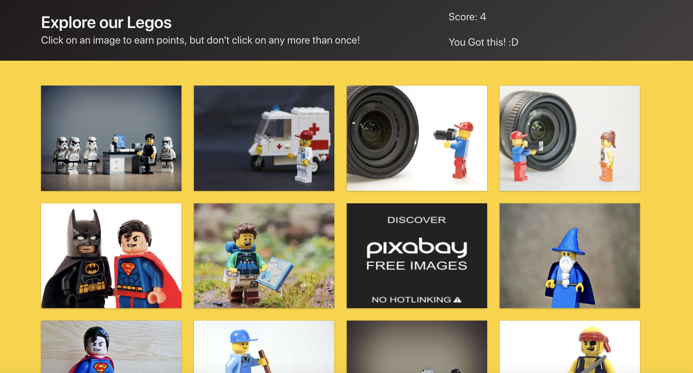

# Clicky Lego Game

This project was bootstrapped with [Create React App](https://github.com/facebook/create-react-app) and
style with [Bulma](https://bulma.io/)

- The application renders different lego images to the screen. 
- Each image should listen for click events.
- The application should keep track of the user's score.
- The user's score should be incremented when clicking an image for the first time and it will be reset to 0 if they 
click the same image more than once.
- The score is shown in the right upper conner.
- Images are served by pixabay

